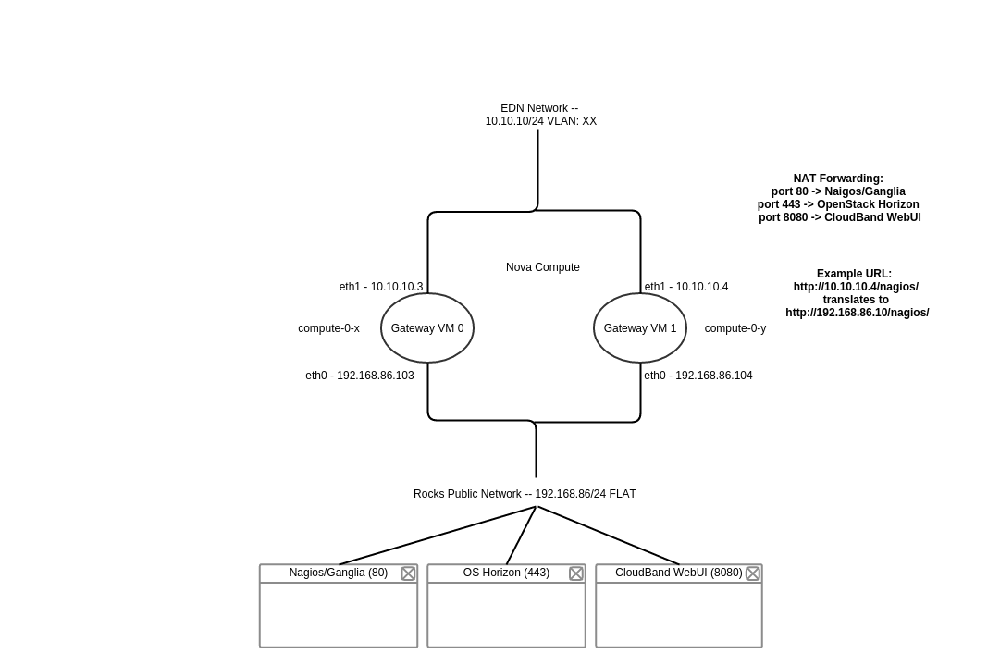

# nat-gateway
Nat all traffic to an OpenStack Linux cluster using a guest VM

The project encoded in this repository enables an OpenStack node to be served by a single NATed IP address.

The following services are accessable through the NAT service:

   - Nagios/Ganglia
   - OpenStack Horizon
   - Management WebUI

Other services can be added as needed.

The idea here is that the rocks public network is deployed on an RFC1918 private network (192.168.1.0/24 for example) with no external access to the datacenter or lab. There is however an existing customer provided network trunked to the node. We call this the CAN, or Customer Access Network. It is deployed within neutron with the corrisponding subnet and VLAN. Then, using a service VM deployed within OpenStack, one can multi-home the service VM, connecting both the rocks public network and the CAN network. Using iptables, packets destined for the IP of the CAN interface on the service VM are transparently rewritten and forwarded to the appropriate services within the node and re-translated on the way back to the user on the CAN network. Using this method, a customer can access the above services using just a single IP on the CAN network, preserving their routable IP space.

```
   # vim nat_deploy.sh (Add CAN network details)
   # bash nat_deploy.sh
```

You can deploy up to 9 nat-gateway instances for redundancy. Each requires an IP from the CAN. If you only deploy a single instance, post-install tests are not run. If you deploy 2 or more, the script will check to see that all end-points are available through all deployed gateways.



